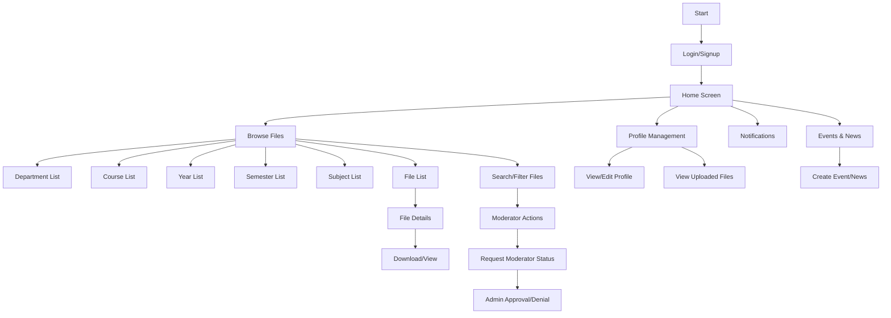

# Campus Collab
A University File Collaboration System

## Authentication Flow
- **Login/Signup**: Users log in or sign up using Firebase Authentication.
  - Email-based authentication limited to `@klu.ac.in` domain.
  - Firebase Authentication handles:
    - User login
    - User signup
    - Forgot password

## Home Screen
- **Options**:
  - Browse Files
  - Manage Profile
  - Access Notifications

## Browse Files
- **File Categories**:
  - Departments
  - Courses
  - Academic Years
- **File Actions**:
  - View Details
  - Download File

## File Details
- **Metadata Display**:
  - Title
  - Description
  - Uploader
  - Date Uploaded
  - File Size
- **Actions**:
  - Download File

## Profile Management
- **Actions**:
  - View/Edit Profile
  - View Uploaded Files

## Moderator Approval Process
- **Request**: User applies to become a moderator.
- **Admin Review**: Admin reviews and approves/rejects the application.

## Notifications
- **Actions**:
  - Admin/Moderators send notifications to users via Firebase Cloud Messaging.
  - Users manage notification preferences.

## Search and Filter Files
- **Actions**:
  - Search for files based on keywords.
  - Filter search results.
  - Sort files.

## Logout
- **Action**: User logs out of the app.

## Firebase Integration
- **Firebase Authentication**:
  - Secure user authentication with email-based login for `@klu.ac.in` domain.
- **Firebase Storage**:
  - Store and manage PDF and image files.
  - Manage metadata for each file (e.g., title, description, uploader, date, file size).
- **Firebase Firestore**:
  - Store file metadata and user information.
  - Support CRUD operations for files and metadata.
- **Firebase Cloud Messaging**:
  - Send notifications to users.
  - Admin/Moderators send notifications, with admin approval.
- **Firebase Analytics**:
  - Monitor app usage, including the number of downloads and active installations.
  - Track user activities and interactions.

## Flow Chart

# List of Pages and Menus

## Login/Signup Page
- Login Form
- Signup Form
- Forgot Password

## Home Screen
- Browse Files
- Manage Profile
- Notifications
- Events & News

## Browse Files
- Department List
- Course List
- Year List
- Semester List
- Subject List
- File List
- File Details (with metadata, preview, and download button)
- Search/Filter Files

## Profile Management
- View/Edit Profile
- View Uploaded Files

## Notifications
- View Notifications
- Manage Notification Preferences

## Events & News
- View Events
- View News Articles
- Create Event/News (Admin/Moderator)

## Moderator Actions
- Request Moderator Status
- View Status of Request

## Admin Interface
- Approve/Deny Moderator Requests
- View User List
- Edit/Remove Users
- Send Notifications

# Permissions by User Role

## Normal User
- Login/Signup
- Browse Files
- View File Details
- Download Files
- Manage Profile
- View Notifications
- View Events & News
- Request Moderator Status

## Moderator
- All permissions of a Normal User
- Upload Files
- Create Events
- Post News Articles
- Send Notifications (with Admin Approval)

## Admin
- All permissions of a Moderator
- Approve/Deny Moderator Requests
- View/Edit/Remove Users
- Send Notifications
- Full Access to All Files and Metadata
- Manage System Settings
